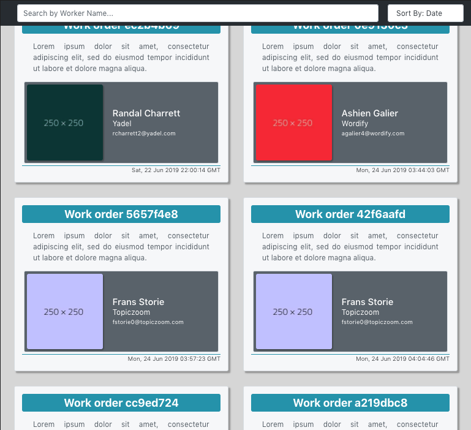

# Orders App

## Description

An Order Listings Front End Application. Displays a list of orders retrieved from API. Each order has worker id assigned, where the worker's information can also be retrieved from the API. Orders can be filtered by worker's name and be sorted by date.


_Above image is a screenshot of the app on a Firefox browser_

## How To Use

This project was bootstrapped with [Create React App](https://github.com/facebook/create-react-app).

**Note**: System should have the latest version of [Node](https://nodejs.org/en/), [git](https://git-scm.com/downloads), and npm

1. Download or Clone the repo using terminal

```bash
$ git clone https://github.com/cye158/work-orders.git
```

2. `cd` into project folder `work-orders`

```bash
$ cd work-orders
```

3. Install the dependencies needed

```bash
$ npm install
```

4. Launch application

```bash
$ npm start
```
